# RTL Implementation of PRESENT Cipher with Hamming Error Correction
---
# Table of Contents

- [Introduction](#introduction)
- [Methodology](#methodology)

---
# Introduction
This project focuses on the hardware implementation of a secure communication system by integrating the PRESENT lightweight block cipher with Hamming error correction.
Encryption and decryption ensure data confidentiality, while error correction improves robustness against transmission errors.
The work emphasizes modular RTL design and testbench based verification.

---
# Methodology
- Implemented the PRESENT lightweight block cipher in Verilog for both encryption and decryption.
- Verified encryption and decryption using independent testbenches and official test vectors from the original PRESENT paper.
- Designed a 16-bit Hamming encoder and decoder and validated their functionality by injecting single-bit errors through testbenches.
- Developed a transmitter module where the 64-bit encrypted output is divided into four 16-bit chunks and encoded using parallel Hamming encoders, producing an 84-bit transmittable data stream.
- Implemented a receiver module that decodes the received data using Hamming decoders, correcting single-bit errors in each chunk.
- Recombined the corrected data and applied PRESENT decryption to recover the original plaintext.
- Verified the complete transmitter–receiver chain in a single testbench by injecting one error per chunk and confirming correct data recovery.

---
# PRESENT Block Cipher
PRESENT is a lightweight block cipher designed for resource-constrained hardware systems.
It operates on 64-bit data blocks and uses a simple substitution–permutation network structure.
The cipher is widely used in low-power and embedded security applications.

Detailed specifications and algorithm steps for the PRESENT cipher are available in the [original paper](https://www.iacr.org/archive/ches2007/47270450/47270450.pdf).

---
## PRESENT Encryption

- Initialize the 64-bit plaintext as the internal state.
- Perform round key addition by XORing the state with the generated round key.
- Apply the substitution layer (S-box) to the state for non-linearity.
- Apply the permutation layer (P-layer) to diffuse the bit positions.
- Repeat the above steps for the defined number of rounds.
- Perform a final round key addition to produce the ciphertext.

---
## PRESENT Decryption

- Initialize the 64-bit ciphertext as the internal state.
- Perform round key addition using the final round key (RoundKey32).
- For rounds 31 down to 1, repeat:
  - Apply the inverse permutation layer (P⁻¹-layer).
  - Apply the inverse substitution layer (inverse S-box) to all 4-bit nibbles.
  - Perform round key addition using the corresponding round key.
- The final output is the recovered plaintext.

---
# Verilog Implementation

The system is divided into two major blocks: a transmitter and a receiver.
- The transmitter performs PRESENT encryption followed by Hamming encoding to ensure confidentiality and error resilience.
- The receiver performs Hamming decoding to correct single-bit errors and then applies PRESENT decryption to recover the original plaintext.

Each module was independently verified before integration.

---
## PRESENT Encryptor

The PRESENT encryptor implements the encryption functionality of the PRESENT lightweight block cipher in Verilog. It operates on 64-bit plaintext data and generates a 64-bit ciphertext output using round-based transformations.

Each encryption round consists of round key addition, substitution using the S-box, and bit permutation using the P-layer. The encryptor follows the standard PRESENT specification, and the design was verified using testbenches with official test vectors from the original paper.

### RTL Schematic :    
The figure below shows the RTL schematic of the PRESENT encryptor implementation.  

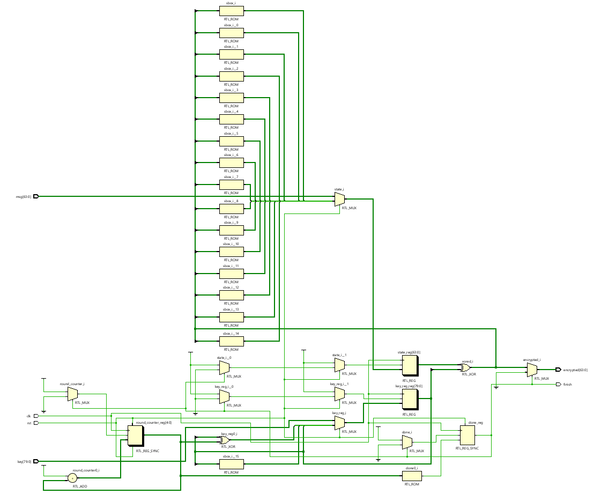    

### Simulation Results :

The following test vectors are taken from the original PRESENT cipher paper. These vectors were applied in the Verilog testbench, and the simulated ciphertext outputs matched the expected results, confirming the correctness of the encryption implementation. 

| Plaintext         | Key                    | Ciphertext        |
| ----------------- | ---------------------- | ----------------- |
| 00000000 00000000 | 00000000 00000000 0000 | 5579C138 7B228445 |
| 00000000 00000000 | FFFFFFFF FFFFFFFF FFFF | E72C46C0 F5945049 |
| FFFFFFFF FFFFFFFF | 00000000 00000000 0000 | A112FFC7 2F68417B |
| FFFFFFFF FFFFFFFF | FFFFFFFF FFFFFFFF FFFF | 3333DCD3 213210D2 | 

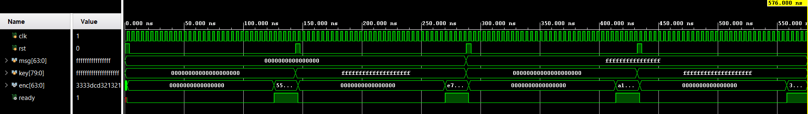   
Test Vector 1:
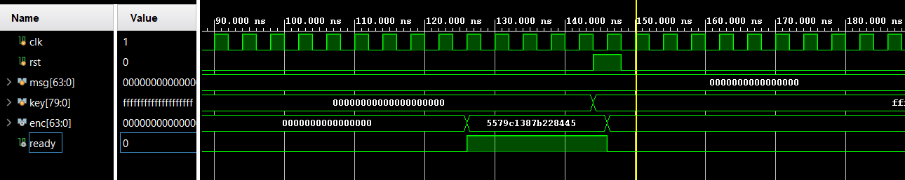   
Test Vector 2:
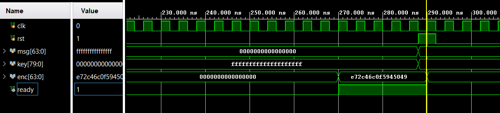 
Test Vector 3:
 
Test Vector 4:
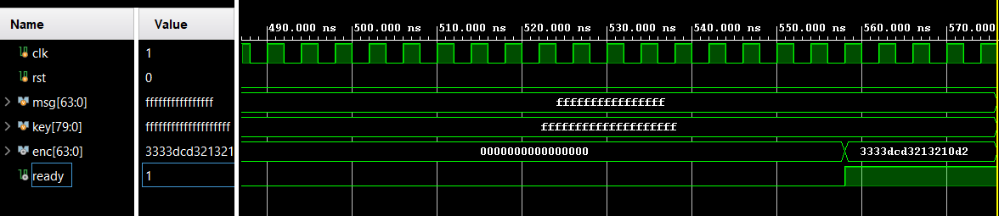  

The above results confirm the correctness of the encryption implementation.

---
## PRESENT Decryptor

The PRESENT decryptor implements the decryption functionality of the PRESENT lightweight block cipher in Verilog. It takes a 64-bit ciphertext as input and recovers the original 64-bit plaintext using inverse round-based transformations.

Each decryption round consists of inverse round key addition, inverse substitution using the inverse S-box, and inverse bit permutation using the inverse P-layer. The decryptor follows the standard PRESENT specification and was verified using dedicated testbenches to ensure correct recovery of the original data.

### RTL Schematic :    
The figure below shows the RTL schematic of the PRESENT decryptor implementation.  

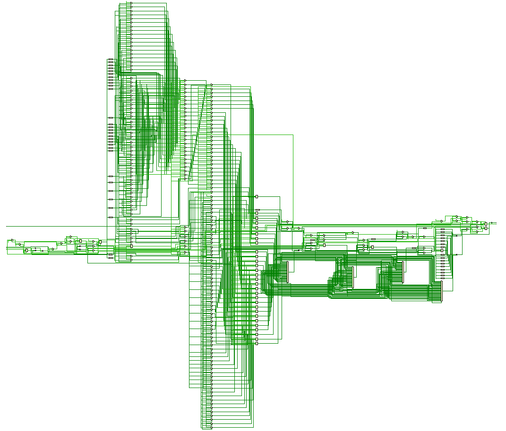   

### Simulation Results :

The following test vectors are taken from the original PRESENT cipher paper. These vectors were applied in the Verilog testbench, and the simulated outputs matched the expected results, confirming the correctness of the decryption implementation. 

| Ciphertext        | Key                    | Plaintext          |
| ----------------- | ---------------------- | ------------------ |
| 5579C138 7B228445 | 00000000 00000000 0000 | 00000000 00000000  |
| E72C46C0 F5945049 | FFFFFFFF FFFFFFFF FFFF | 00000000 00000000  |
| A112FFC7 2F68417B | 00000000 00000000 0000 | FFFFFFFF FFFFFFFF  |
| 3333DCD3 213210D2 | FFFFFFFF FFFFFFFF FFFF | FFFFFFFF FFFFFFFF  |

  
Test Vector 1:                        
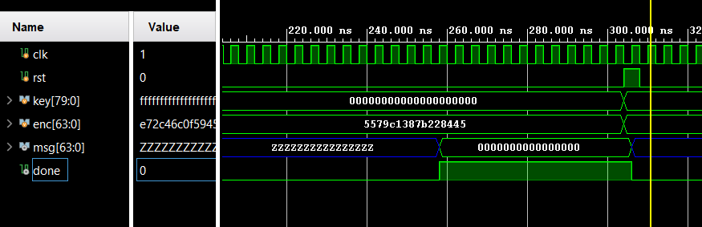  
Test Vector 2:
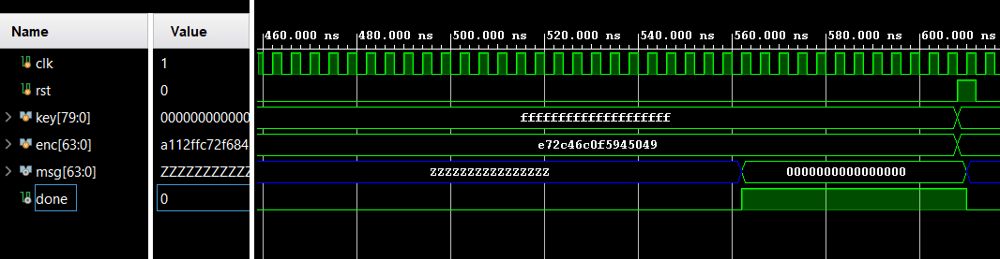 
Test Vector 3:
 
Test Vector 4:
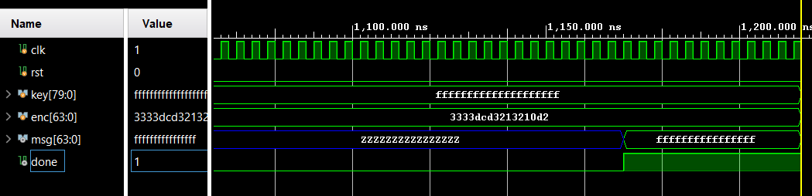  

The above results confirm the correctness of the decryption implementation.

---
## Hamming Encoder and Decoder

- The Hamming encoder performs error correction encoding on 16-bit input data by generating and appending parity bits.
   The encoder produces a 21-bit encoded output, enabling single-bit error detection and correction during data transmission.

- The Hamming decoder receives the 21-bit encoded data and checks for errors using the parity bits.
  It can detect and correct single-bit errors, ensuring data integrity, and outputs the original 16-bit input data after correction.

### Hamming Encoder RTL Schematic :
The figure below shows the RTL schematic of the Hamming Encoder implementation.  

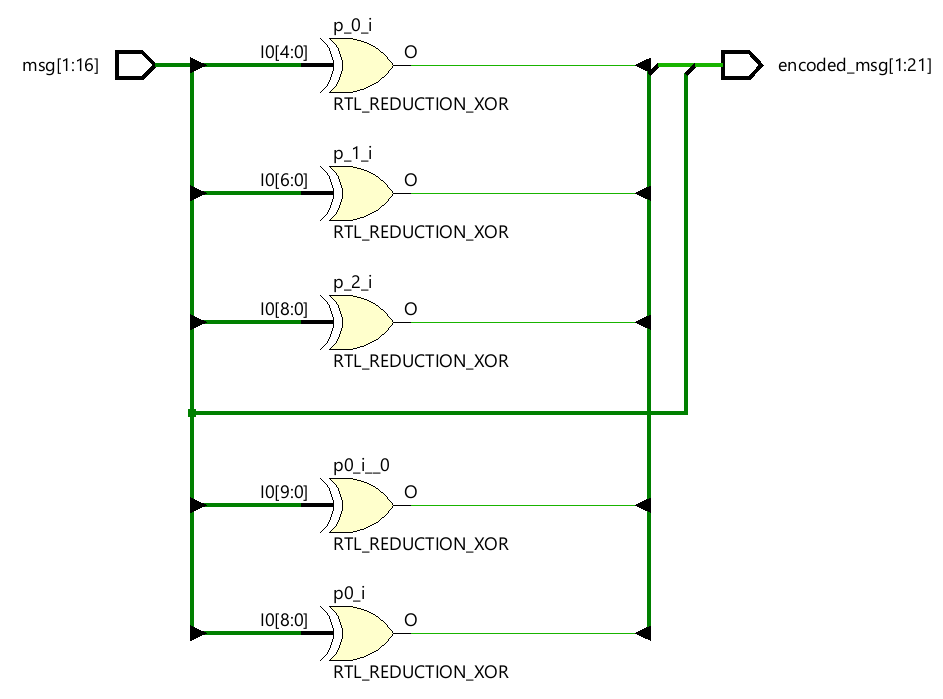   

### Hamming Decoder RTL Schematic :
The figure below shows the RTL schematic of the Hamming Decoder implementation. 

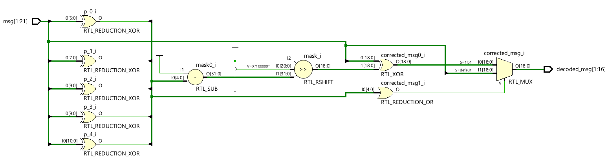   

### Simulation Results :

Both the Hamming encoder and decoder have been verified using a common testbench, which applies test cases by injecting single bit errors
to ensure correct encoding, error detection, and correction functionality.

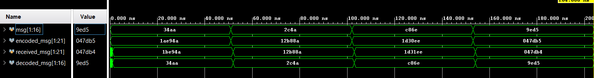   

---
## Transmitter 

The transmitter module integrates the PRESENT cipher encryption with Hamming error correction to generate secure and reliable transmittable data. The 64-bit plaintext is first encrypted using the PRESENT cipher
to produce a 64-bit ciphertext.

The encrypted output is then divided into four 16-bit chunks. Each chunk is independently processed by a 16-bit Hamming encoder to add redundancy for single-bit error correction. The encoded outputs are
combined to form an 84-bit data stream, which represents the final output of the transmitter module.

This parallel encoding approach enables error correction capability while preserving the security provided by encryption.

### RTL Schematic
The figure below shows the RTL schematic of the Transmitter implementation.  

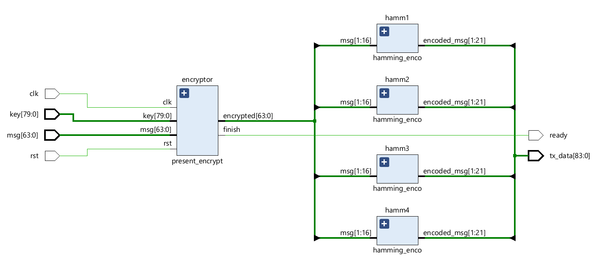  

---

## Receiver

The receiver module processes the transmitted data to recover the original plaintext while correcting any single-bit errors. The 84-bit received data is first divided into four 21-bit chunks, each corresponding to the output of a Hamming encoder in the transmitter.

Each chunk is independently decoded by a 16-bit Hamming decoder, which detects and corrects single-bit errors. The corrected 64-bit data is then recombined and passed to the PRESENT decryptor to reverse the encryption process, producing the original 64-bit plaintext.

This modular decoding and decryption process ensures reliable data recovery while maintaining the confidentiality provided by the encryption.

### RTL Schematic
The figure below shows the RTL schematic of the Receiver implementation.  

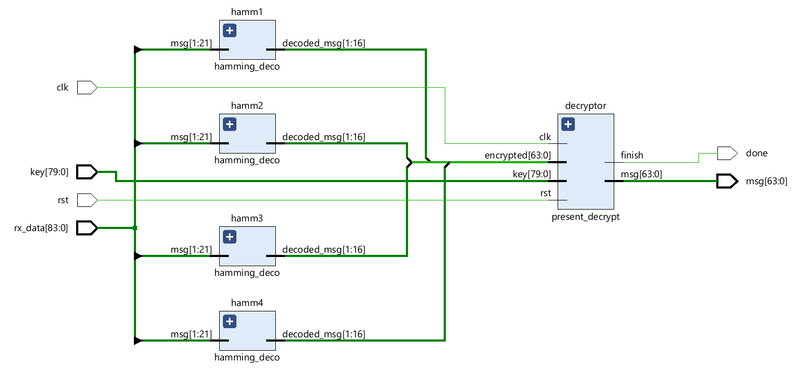

---

## Transmitter–Receiver Simulation Results

A common testbench was developed to simulate the complete transmitter–receiver system. During simulation, single-bit errors were injected at one position in each of the four 16-bit chunks of the transmitted data. The system successfully detected and corrected these errors using the Hamming decoders before passing the data to the PRESENT decryptor for recovery.

It is important to note that the error correction capability is limited to single-bit errors per 16-bit chunk; the system can correct one error in each chunk independently but cannot handle multiple errors within a single chunk.

**Example Test vector:**

| Description                                      | Value                         |
|-------------------------------------------------|-------------------------------|
| Key                                             | 00000000 00000000 0000       |
| Plaintext Message                               | 0123456789abcdef             |
| Transmitter Output (PRESENT Encryptor + Hamming Encoder) | dd0539648b8ec2019425b       |
| Received Data with Single-Bit Errors Injected in Each 16-bit Chunk | dd0531648bcec2039425a       |
| Received Message (Hamming Correction + PRESENT Decryption) | 0123456789abcdef             |

The complete transmitter–receiver system successfully transmits encrypted data, corrects single-bit errors in each chunk using Hamming decoders, and recovers the original plaintext through PRESENT decryption, demonstrating secure and reliable data communication.

---
# Conclusion

This project demonstrates the integration of the PRESENT lightweight block cipher with Hamming error correction in Verilog. By combining encryption and error correction, the design ensures both data confidentiality and reliability during transmission. The modular RTL implementation, along with testbench-based verification, confirms correct encryption, decryption, error detection, and single-bit error correction. Overall, the work highlights how cryptography and error correction can be effectively combined in hardware to achieve secure and robust communication systems.

